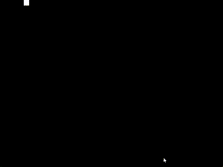

# Add an Object

An entity is essentially the same as a GameObject in most game engines.

The entity object has 4 main functions inside of it.

```py
center() # Centers the object.
collide(entity) # Collides with another Entity object.
distance(entity1, entity2) # Gets the distance between 2 Entity objects.
draw() # Draws the Entity. Use inside a draw loop.
```

To create an entity, add an entity object before your draw and update loops.

```py
#  width = 20, height = 20, x = 0, y = 0, color = (255, 255, 255, 255)
obj = spawnbox.Entity(sbox, 20, 20, 0, 0, (255, 255, 255, 255))
# The arguments to the Entity object are:
# SpawnBox object (which we created earlier), width, height, x, y, color.
# The color is a RGBA tuple. (red, green, blue, transparency)
```
NOTE: The game may crash if you don't define transparency.

Now, you can make it move in your update function.

```py
@sbox.addUpdater
def update(delta):
    [...] # Remove the 'pass' object we put here.
    obj.x += 100 * delta # adds ~1.667 to the X position.
```

We also need to be able to draw our box to the screen, so let's do that really quickly.

```py
@sbox.addDrawer
def draw():
    obj.draw()
```

And boom, we now have a box that moves about 2 pixels per frame.


