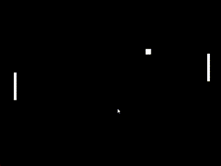

# Collision and AI

Now that we have a good base on our project, let's add an AI enemy, and collision.

The enemy AI is pretty easy.

Add a function under the ```player_movement``` function (inside of the Paddle class) called "```ai_movement```"

It should look like this:

```py
    def ai_movement(self, delta):
        if self.ball.y > self.y:
            self.y += 235 * delta
        if self.ball.y < self.y:
            self.y -= 235 * delta

        if self.y < 0:
            self.y = 0
        elif self.y > sbox.height - self.height:
            self.y = sbox.height - self.height
```

And now, create a new Paddle object under the ball named "enemy", like so:

```py
enemy = Paddle(sbox.width - 50, 0)
enemy.center_y()
```

Now, put this code in the init function:

```py
@sbox.init
def init(self):
    enemy.ball = ball
```

This will set the enemy's ball parameter, that way the movement will work.

Then, call the ```ai_movement(delta)``` function after we call the ```ball_movement(delta)``` function in the update function.

Your ```update()``` function should like this:
```py
@sbox.addUpdater
def update(delta):
    player.player_movement(delta)
    ball.ball_movement(delta)
    enemy.ai_movement(delta)
```

Lastly, draw the enemy like we do the ball and the player.

<hr />

Now, for collision.

It's not too hard with what we've set up here.

At the top of your update function (before the ball and player movement functions are called), add the following code.

```py
    if ball.collide(player) or ball.collide(enemy):
        ball.h_dir *= -1
```

That will make it collide with the player and enemy.

Now, test your file.



Of course, like shown to the GIF above, there are minor bugs, but the game's pretty decent.

And that's our Pong game completed.

You may extend it however you'd like.