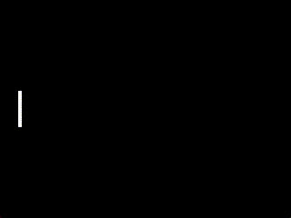

# Making our player

We need to discuss something really quick.

Because Python is object-oriented, we can create classes that inherit methods / properties from other classes.

Meaning, we can create a class in our ```pong.py``` file that inherits the functions and properties from the ```Entity``` class from SpawnBox.

So let's do that.

```py
[...] # before the update method, after we create a SpawnBox object.

class Paddle(Entity):
    def __init__(self, x, y): # we can leave most of the parameters as their default values.
        super().__init__(sbox, 10, 100, x, y)
        self.ball = None # this will be used for the enemy
```

Now that we have a base Paddle class, let's create the ```player_movement()``` function.

```py
    def player_movement(self, delta):
        if sbox.input.pressed[sbox.input.keys["W"]]:
            self.y -= 235 * delta
        if sbox.input.pressed[sbox.input.keys["S"]]:
            self.y += 235 * delta
        # If we use elif there, you can't stay still when you hold both keys.

        # Collision with the floor.
        if self.y < 0:
            self.y = 0
        elif self.y > sbox.height - self.height:
            self.y = sbox.height - self.height
```

Now, let's create our player.

```py
# before the update function

player = Paddle(50, 0)
player.center_y() # center the y axis. built-in function.

```
And then, put the player.player_movement() function in our update function.

```py
[...]
@sbox.addUpdater
def update(delta):
    player.player_movement(delta)
```

Make sure you draw the player in your draw() function, and run the mainloop() function after your init() function.

```py
[...]
@sbox.addDrawer
def draw():
    player.draw()

@sbox.init
def init():
    pass # we will use this later!

sbox.mainloop()
```

Now, run the python file.



Boom! We have a paddle moving! Now, time for the ball.