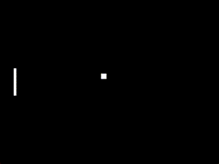

# The Ball

The ball is simpler than you think.

First, at the top of your file, import the `random` package. It is pre-installed into Python.

```py
import random
```

Next, create a class below the Paddle class.

```py
class Ball(Entity):
    def __init__(self, x, y):
        super().__init__(sbox, 20, 20, x, y)
        self.reset() # will create function later
```

Now, let's add the reset function.

```py
    def reset(self):
        self.center()
        self.h_dir = random.choice((-1, 1)) # backwards or forwards
        self.v_dir = random.choice((-1, 1)) # up or down
```

And finally, a movement function.

```py
    def ball_movement(self, delta):
        self.x += 250 * self.h_dir * delta
        self.y += 250 * self.v_dir * delta

        if self.y <= 2 or self.y >= sbox.height - 20:
            self.v_dir *= -1
        if self.x <= 0:
            self.reset()
        elif self.x >= sbox.width:
            self.reset()
```

Now, you can create a ```Ball``` object after the player.

```py
player = Paddle(50, 0)
player.center_y()

ball = Ball(0, 0)
```

And, in your update function, call the ```ball.ball_movement``` function.

```py
@sbox.addUpdater
def update(delta):
    player.player_movement(delta)
    ball.ball_movement(delta)
```

Make sure to draw your ball to the screen, like how we did with the player.

Now, run your project!



Let's add collision and the enemy player now!